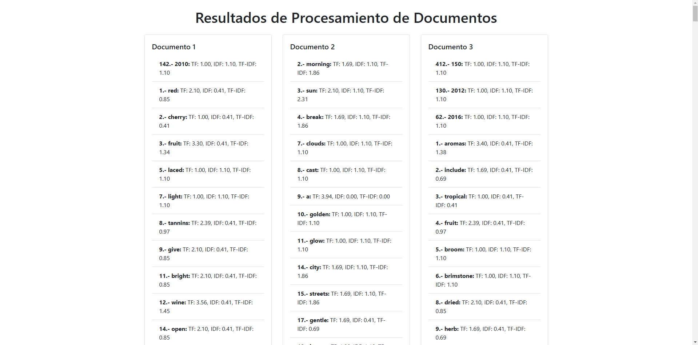
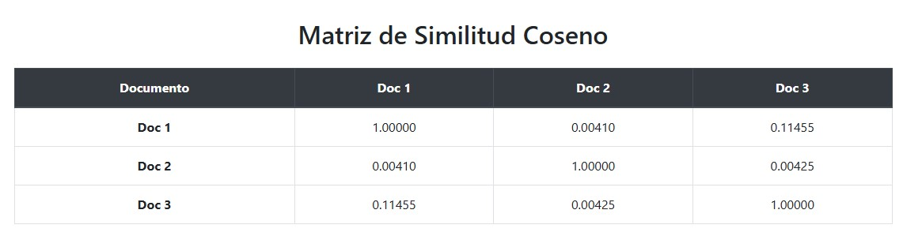

# Gestion del Conocimiento de las Organizaciones: Sistemas de recomendación. Modelos basados en el contenido


**Integrantes del grupo:** 
- Ancor Gonzalez Carballo ([alu0101327679](alu0101327679@ull.edu.es))
- Joel Aday Dorta Hernández ([alu0100987584](alu0100987584@ull.edu.es))
- Jose Pablo Ruiz Galvan ([alu0101328447](alu0101328447@ull.edu.es))
- Jose Javier Ramos Carballo ([alu0101313313](alu0101313313@ull.edu.es))

---

# Índice

1. [Introducción](#1-introducción)
2. [Codigo Desarrollado](#2-codigo-desarrollado)
3. [Ejemplo de Uso](#3-ejemplo-de-uso)
4. [Conclusiones](#4-conclusiones)

---

# 1. Introducción

El objetivo de esta práctica es implementar un sistema de recomendación siguiendo el modelo basados en el contenido.

---

# 2. Codigo Desarrollado

Para comenzar hablando del codigo, en este proyecto, nos encargamos de implementar nuestra herramienta via web, por ello no se requiere de instalaciones y/o despliegues para
poder utilizar la herramienta desarrollada. Para conocer su uso, le recomendamos leer el [punto 3](#3-ejemplo-de-uso) de este informe, que explica con detalles como utilizarlo.

Con ello, empezamos señalando la primera parte del codigo

```HTML

<head>
    <meta charset="UTF-8">
    <meta name="viewport" content="width=device-width, initial-scale=1.0">
    <title>Procesar Archivo</title>
    <link rel="stylesheet" href="https://stackpath.bootstrapcdn.com/bootstrap/4.5.2/css/bootstrap.min.css">
</head>

```

Para empezar, tenemos el _head_ de la pagina, donde encontramos ciertos metadatos y/o bibliotecas que utilizamos para implementar la pagina.  
Concretamente, utilizamos _Bootstrap_ como hoja de estilo, para tener un diseño limpio y sencillo sobre la herramienta.

Luego mas adelante empezamos a definir el cuerpo de la pagina con el siguiente codigo:

```HTML
<div class="container mt-5">
    <h1 class="mb-4">Procesar Archivo</h1>

    <div class="form-group col-md-6">
        <label for="fileInput">Selecciona los archivos a procesar:</label>
        <div class="custom-file">
            <input type="file" class="custom-file-input" id="fileInput" accept=".txt" multiple />
            <label class="custom-file-label" for="fileInput">Elige los archivos...</label>
        </div>
    </div>

    <div class="form-group col-md-6">
        <label for="stopWordsInput">Selecciona el archivo de palabras de parada:</label>
        <div class="custom-file">
            <input type="file" class="custom-file-input" id="stopWordsInput" accept=".txt" />
            <label class="custom-file-label" for="stopWordsInput">Elige un archivo...</label>
        </div>
    </div>

    <div class="form-group col-md-6">
        <label for="lemmatizationInput">Selecciona el archivo de lematización:</label>
        <div class="custom-file">
            <input type="file" class="custom-file-input" id="lemmatizationInput" accept=".txt" />
            <label class="custom-file-label" for="lemmatizationInput">Elige un archivo...</label>
        </div>
    </div>

    <div class="form-group col-md-6">
        <button id="processButton" class="btn btn-primary">Procesar</button>
    </div>
</div>
```
En esta parte del codigo, definimos las 3 entradas de archivos que tiene nuestra aplicación a nivel visual.

Mientras que en codigo que viene a continuación, nos encargamos de hacer funcional las tres entradas permitiendo entrar ficheros en cada una,
concretamente en el primero de los 3, donde podemos incluir mas de un fichero para poder hacer mejores computos.

```html

<script>
    document.getElementById("fileInput").addEventListener("change", function () {
        const label = this.nextElementSibling;
        label.innerText = this.files.length ? `${this.files.length} archivos seleccionados` : "Elige un archivo...";
    });

    document.getElementById("stopWordsInput").addEventListener("change", function () {
        const fileName = this.files[0] ? this.files[0].name : "Elige un archivo...";
        this.nextElementSibling.innerText = fileName;
    });

    document.getElementById("lemmatizationInput").addEventListener("change", function () {
        const fileName = this.files[0] ? this.files[0].name : "Elige un archivo...";
        this.nextElementSibling.innerText = fileName;
    });

```

A partir de este punto, empezamos a tratar con el codigo de la herramienta.

Para empezar definimos una clase _PalabrasManager_, donde pudiesemos medir todos los parametros con los que queremos operar.
Bajo nuestra implementación, tenemos un constructor, que define los siguientes atributos:

- **_this.stopwords_**: almacena una lista de palabras que se pretenden ignorar al procesar los textos.
- **_this.lemmatizationDict_**: contiene el diccionario requerido para hacer la lematización.
- **_this.resultados_**: es un objeto que contiene las palabras despues de ser procesadas junto a su frecuencia en los textos.
- **_this.idf_**: Almacena los valores del calculo IDF sobre cada termino procesado
- **_this.documentos_**: es una lista que contiene los ficheros que queremos procesar
- **_this.tfIdfVectors_**: almacena los vectores TF-IDF normalizados de cada documento
- **_this.similitudesCoseno_**: contiene una lista que guarda los resultados de la similutud de coseno entre los textos procesados.

```javascript
class PalabrasManager {
    constructor() {
        this.stopWords = [];
        this.lemmatizationDict = {};
        this.resultados = {};
        this.idf = {};
        this.documentos = [];
        this.tfIdfVectors = [];
        this.similitudesCoseno = [];
    }
}
```

A partir de ahi, empezamos a definir los diferentes metodos requeridos de la clase.

- **_cargarStopWords(content)_**: recibe el segundo archivo pasado y las mapea para convertirlas en _stopwords_
Cabe señalar que las palabras, las procesa en minuscula y elimina los espacios vacios.

```javascript
cargarStopWords(content) {
    this.stopWords = content.split('\n').map(word => word.trim().toLowerCase()).filter(Boolean);
}
```

- **_cargarLematizacion(content)_**: recibe el tercer fichero pasado y lo convierte en un objeto convertirlas en _lemmatizationDict_
para utilizarlo como el diccionario con el que lematizar los documentos a procesar.

```javascript
cargarLematizacion(content) {
    this.lemmatizationDict = JSON.parse(content);
}
```

- **_esStopWords(content)_**: funciona como la flag que nos comprueba si la palabra a procesar es encuentra en _stopwords_.
En caso afirmativo, devuelve true, sino devuelve false.

```javascript
esStopWord(palabra) {
    return this.stopWords.includes(palabra);
}
```

- **_lematizar(content)_**: busca en el diccionario de lematización y devuelve la forma lematizada de una palabra 
si está en el diccionario; si no, devuelve la palabra original.

```javascript
lematizar(palabra) {
    return this.lemmatizationDict[palabra] || palabra;
}
```

- **_procesarArchivo(content)_**: Este método toma el contenido de un documentos a procesar, lo procesa 
para eliminar signos de puntuación y lo separa en palabras individuales.  
Especificamente, realiza las siguientes tareas:

    - Elimina las _stopwords_ y lematiza las palabras
    - Cuenta la frecuencia de cada palabra y las almacena en _resultadosDoc_
    - Al final, llama al metodo **_calcularTF()_** para alcular la frecuencia ponderada de las palabras

Finalmente devuelve _resultadosDoc_, donde se encuentra cada palabra con su valor de frecuencia.

```javascript
procesarArchivo(content) {
    const resultadosDoc = {};
    const palabras = content.replace(/[.,;!?()""]/g, '').split(/\s+/).filter(Boolean);

    palabras.forEach(palabra => {
        const palabraLower = palabra.toLowerCase();
        if (!this.esStopWord(palabraLower)) {
            const lematizada = this.lematizar(palabraLower);
            if (!resultadosDoc[lematizada]) {
                resultadosDoc[lematizada] = { count: 0 };
            }
            resultadosDoc[lematizada].count += 1;
        }
    });

    this.resultados = resultadosDoc;
    this.calcularTF();
    return resultadosDoc;
}
```

- **_calcularTF()_**: Este método calcula la frecuencia de término ponderada (TF) de cada palabra en resultados.

```javascript
calcularTF() {
    for (const palabra in this.resultados) {
        const count = this.resultados[palabra].count;
        const frecuencia = 1 + Math.log(count);
        this.resultados[palabra].frecuencia = frecuencia;
    }
}
```

- **_calcularIDF(documentos)_**: Este método calcula el valor de IDF para cada palabra en una colección de documentos.  
Para conseguir ese resultado, lo que hace es:

    - Convierte cada documento en un conjunto de palabras únicas
    - Cuenta en cuántos documentos aparece cada palabra, excluyendo las _stopWords_.


```javascript
calcularIDF(documentos) {
    const N = documentos.length;
    const documentoFrecuencia = {};

    documentos.forEach(content => {
        const palabrasUnicas = new Set(
            content.replace(/[.,;!?()""]/g, '').split(/\s+/).map(palabra => this.lematizar(palabra.toLowerCase())).filter(Boolean)
        );

        palabrasUnicas.forEach(palabra => {
            if (!this.esStopWord(palabra)) {
                documentoFrecuencia[palabra] = (documentoFrecuencia[palabra] || 0) + 1;
            }
        });
    });

    for (const palabra in documentoFrecuencia) {
        this.idf[palabra] = Math.log(N / documentoFrecuencia[palabra]);
    }
}
```

- **_calcularTFIDFNormalizado(documentos)_**: Este método crea un vector TF-IDF normalizado para un documento.  
Es decir, que por cada palabra:

    - Multiplica su TF por el IDF correspondiente.
    - Calcula la magnitud del vector TF-IDF usando la norma euclidiana.
    - Normaliza cada componente del vector dividiéndolo por la magnitud total

Devolviendo asi un vector TF-IDF normalizado por documento.


```javascript
calcularTFIDFNormalizado(resultadosDoc) {
    const tfIdfVector = {};
    for (const palabra in resultadosDoc) {
        const tf = resultadosDoc[palabra].frecuencia;
        const idf = this.idf[palabra] || 0;
        tfIdfVector[palabra] = tf * idf;
    }

    const magnitud = Math.sqrt(Object.values(tfIdfVector).reduce((sum, value) => sum + value * value, 0));
    for (const palabra in tfIdfVector) {
        tfIdfVector[palabra] /= magnitud;
    }

    return tfIdfVector;
}
```

- **_calcularSimilitudCoseno()_**:  calcula la similitud de coseno entre los vectores TF-IDF de cada par de documentos.  
Gracias a este metodo, podemos definir la simititud entre los diferentes ficheros que aportemos para procesar.

```javascript
calcularSimilitudCoseno() {
    for (let i = 0; i < this.tfIdfVectors.length; i++) {
        for (let j = i + 1; j < this.tfIdfVectors.length; j++) {
            const vectorA = this.tfIdfVectors[i];
            const vectorB = this.tfIdfVectors[j];

            const palabrasUnidas = new Set([...Object.keys(vectorA), ...Object.keys(vectorB)]);
            let productoPunto = 0;
            let magnitudA = 0;
            let magnitudB = 0;

            palabrasUnidas.forEach(palabra => {
                const valorA = vectorA[palabra] || 0;
                const valorB = vectorB[palabra] || 0;
                productoPunto += valorA * valorB;
                magnitudA += valorA * valorA;
                magnitudB += valorB * valorB;
            });

            const similitud = productoPunto / (Math.sqrt(magnitudA) * Math.sqrt(magnitudB));
            this.similitudesCoseno.push({ docA: i + 1, docB: j + 1, similitud });
        }
    }
}

```

- **_generarJsonSalida()_**: crea un archivo JSON y lo descarga automáticamente al navegador.  
El archivo contiene datos organizados en dos partes: una lista de documentos con sus términos y los valores asociados, y una lista de similitudes de coseno

```javascript
generarJsonSalida() {
    const salida = {
        documentos: this.documentos.map((resultadosDoc, docIndex) => ({
            documento: docIndex + 1,
            terminos: Object.keys(resultadosDoc).map((termino, idx) => ({
                indice: idx + 1,
                termino: termino,
                TF: resultadosDoc[termino].frecuencia,
                IDF: this.idf[termino] || 0,
                TF_IDF: resultadosDoc[termino].frecuencia * (this.idf[termino] || 0)
            }))
        })),
        similitudesCoseno: this.similitudesCoseno
    };

    const blob = new Blob([JSON.stringify(salida, null, 2)], { type: "application/json" });
    const url = URL.createObjectURL(blob);
    const a = document.createElement("a");
    a.href = url;
    a.download = "salida.json";
    a.click();
    URL.revokeObjectURL(url);
}
```

Para el resto del codigo, precisamente nos encargamos de enlazar los metodos descritos o describir el formato de la salida de los datos

Por una parte, creamos un manager de _PalabrasManager_ para poder trabajar con los metodos descritos.

```javascript
const palabrasManager = new PalabrasManager();
```
Luego, nos encargamos de recoger los diferentes ficheros y comprobando que han sido introducidos.

```javascript
document.getElementById('processButton').addEventListener('click', function () {
    const palabrasManager = new PalabrasManager();
    const stopWordsInput = document.getElementById('stopWordsInput');
    const lemmatizationInput = document.getElementById('lemmatizationInput');
    const fileInput = document.getElementById('fileInput');

    if (stopWordsInput.files.length === 0 || lemmatizationInput.files.length === 0 || fileInput.files.length === 0) {
        alert('Por favor, selecciona todos los archivos necesarios.');
        return;
    }
});
```

Con esta parte del codigo, recogemos los documentos a procesar, y comenzamos a procesar las palabras vacias.
Se utiliza un objeto _FileReader_ para leer el archivo de palabras vacías. Cuando el archivo se carga, el contenido del archivo es procesado y pasado a _cargarStopWords()_, 
un método de _PalabrasManager_ que probablemente almacena o procesa las palabras vacías para utilizarlas más adelante.

```javascript
const documentos = [];

const stopWordsReader = new FileReader();
stopWordsReader.onload = function (event) {
    palabrasManager.cargarStopWords(event.target.result);
```

Dentro del lector de _stopWords_, una vez que el archivo de palabras vacías se ha cargado, se configura otro _FileReader_ para leer el archivo de lematización

```javascript
const lemmatizationReader = new FileReader();
lemmatizationReader.onload = function (event) {
    palabrasManager.cargarLematizacion(event.target.result);
```

Después de cargar las palabras vacías y la lematización, el código procede a leer múltiples archivos de texto en el elemento _fileInput_:

Para cada archivo:

- Se lee el contenido usando _FileReader_.
- El contenido del archivo se agrega al arreglo _documentos_.
- Se procesa el archivo usando el método _procesarArchivo_ de _PalabrasManager_, que probablemente limpia el texto, elimina palabras vacías y aplica lematización. El resultado es guardado en la propiedad _documentos_ de _palabrasManager_.

```javascript
Array.from(fileInput.files).forEach(file => {
    const fileReader = new FileReader();
    fileReader.onload = function (event) {
        documentos.push(event.target.result);
        palabrasManager.documentos.push(palabrasManager.procesarArchivo(event.target.result));
    }
});
```

Este fragmento asegura que todos los documentos se han cargado antes de calcular el IDF (Inverse Document Frequency) con calcularIDF. 
El IDF es una medida que indica la importancia de una palabra en relación con otros documentos.

Finalmente, para cada documento, calcula el TF-IDF normalizado, y despues nos encargamos del calculo de similitud de coseno entre documentos
con lo que hay almacenado en _palabrasManager_ y guardamos la salida en un JSON.

```javascript
if (documentos.length === fileInput.files.length) {
    palabrasManager.calcularIDF(documentos);
    documentos.forEach((content, index) => {
        const tfIdfVector = palabrasManager.calcularTFIDFNormalizado(palabrasManager.documentos[index]);
        palabrasManager.tfIdfVectors.push(tfIdfVector);
    });
    palabrasManager.calcularSimilitudCoseno();
    palabrasManager.generarJsonSalida();
}
```

Finalmente queda destacar la presentación de la información calculada, donde nos encargamos de colocar la información por tarjetas de bootstrap, lo que nos permite presentar la información de forma clara. Ahi introducimos todos los parametros que calculamos con las funciones anteriores, ademas de incluir un indice en cada terminno donde se cuenta donde aparece dicho termino por 1ª vez en el documento a analizar.

```javascript

generarSalidaTarjetas() {
    let salida = `
        <!DOCTYPE html>
        <html lang="es">
        <head>
            <meta charset="UTF-8">
            <meta name="viewport" content="width=device-width, initial-scale=1.0">
            <link rel="stylesheet" href="https://maxcdn.bootstrapcdn.com/bootstrap/4.5.2/css/bootstrap.min.css">
            <title>Resultados de Procesamiento de Documentos</title>
        </head>
        <body class="container my-4">
            <h1 class="text-center mb-4">Resultados de Procesamiento de Documentos</h1>
            <div class="row">
    `;

    this.documentos.forEach((resultadosDoc, docIndex) => {
        salida += `
            <div class="col-md-4 mb-4">
                <div class="card">
                    <div class="card-body">
                        <h5 class="card-title">Documento ${docIndex + 1}</h5>
                        <ul class="list-group list-group-flush">`;

        Object.entries(resultadosDoc).forEach(([termino, datos], idx) => {
            const index = datos.idx + 1;
            const tf = datos.frecuencia;
            const idf = this.idf[termino] || 0;
            const tfIdf = tf * idf;
            salida += `<li class="list-group-item">
                            <strong>${index}.- ${termino}:</strong> TF: ${tf.toFixed(2)}, IDF: ${idf.toFixed(2)}, TF-IDF: ${tfIdf.toFixed(2)}
                    </li>`;
        });

        salida += `
                        </ul>
                    </div>
                </div>
            </div>`;
    });

    salida += `
            </div>
            <hr class="my-4">
            <h2 class="text-center mb-4">Matriz de Similitud Coseno</h2>
            <div class="table-responsive">
                <table class="table table-bordered text-center">
                    <thead class="thead-dark">
                        <tr>
                            <th>Documento</th>`;

    for (let i = 0; i < this.documentos.length; i++) {
        salida += `<th>Doc ${i + 1}</th>`;
    }
    salida += `</tr></thead><tbody>`;

    for (let i = 0; i < this.documentos.length; i++) {
        salida += `<tr><td><strong>Doc ${i + 1}</strong></td>`;

        for (let j = 0; j < this.documentos.length; j++) {
            const similitud = i === j ? 1 : (this.similitudesCoseno.find(sim => 
                (sim.docA === i + 1 && sim.docB === j + 1) || 
                (sim.docA === j + 1 && sim.docB === i + 1)) || { similitud: 0 }).similitud;
            salida += `<td>${similitud.toFixed(5)}</td>`;
        }
        salida += `</tr>`;
    }
    salida += `
            </div>
        </body></html>`;

    const nuevaVentana = window.open("", "_blank");
    nuevaVentana.document.write(salida);
    nuevaVentana.document.close();
}

```

---

# 3. Ejemplo de uso

Para poder utilizar nuestra herramienta, debe acceder al siguente [enlace](https://alu0101328447.github.io/GCO_SR_Contenido/), y en él, le aparecerá la sigiente pagina


Una vez en él, debemos introducir una serie de ficheros que se nos indican en la pagina.
Para obtener estos ficheros, se pueden utilizar los aportados en el propio [repositorio](../Data/), donde tenemos ejemplos de los 3 tipos de ficheros que se tienen que introducir, o por lo contrario, en los descripciones que hay a continuación, se pueden obtener los ficheros requeridos para el correcto funcionamiento de la pagina. 

Los archivos requeridos para el correcto funcionamiento de la pagina son:

- **Archivo a procesar**, indican los ficheros con los que queremos trabajar, los cuales, se pueden obtener en el siguiente [enlace](https://github.com/ull-cs/gestion-conocimiento/tree/main/recommeder-systems/examples-documents)  

> [!NOTE]  
> Concretamente en este apartado se recomienda que se aporten mas de un fichero para que los calculos no salgan con valor 0.

- **Stop-Words**, es un fichero que nos permite filtrar que palabras del texto se pueden saltar del calculo. Este fichero se puede conseguir en el siguiente [enlace](https://github.com/ull-cs/gestion-conocimiento/tree/main/recommeder-systems/stop-words)
- **Corpus**, es un fichero que nos permite lematizar los terminos de nuestro texto, permitiendo que a la hora colocar las _palabras mayores_ no resulte en diferentes palabra que se refieren a lo mismo. Dicho fichero se puede obtener en el siguiente [enlace](https://github.com/ull-cs/gestion-conocimiento/tree/main/recommeder-systems/corpus) 

> [!WARNING]  
> Sobre los archivos que vamos a introducir, se requiere que los tres esten escritos en el mismo idioma, para que la aplicación funcione correctamente.

Al colocar los ficheros pertinentes, simplemente podemos ejecutar el programa y este nos dara un fichero llamado **_salida.json_**
donde podemos leer los diferentes parametros pedidos en la practica, y al final del fichero, podemos encontrar el calculo entre las similitudes entre los 
ficheros que pasamos para procesar.

Ademas, en pantalla obtenemos la siguiente salida: 



En ella, podemos encontrar el mismo contenido que el fichero descargable, donde se presenta la información que se buscaba calcular sobre cada termino, ademas de que si nos movemos al final de la pagina, podemos encontrar la siguiente tabla:



Lo que nos muestra el calculo de la similitud entre los diferentes ficheros. Cabe destacar que la tabla es simetrica por su diagonal principal, dado a que con nuestro calculo, lo mismo es comparar el _documento 1_ con el _documento 3_ e viceversa.

---

# 4. Conclusiones

Finalmente, con este apartado terminamos de explicar y comentar nuestra implementación de un sistemas de recomendación mediante los metodos de filtrado colaborativo, los cuales, ofrecen ventajas como la personalización sin depender de la popularidad, la escalabilidad, y la privacidad. Son particularmente efectivos cuando se busca ofrecer recomendaciones de alta precisión a nuevos usuarios y en dominios que demandan adaptabilidad.


