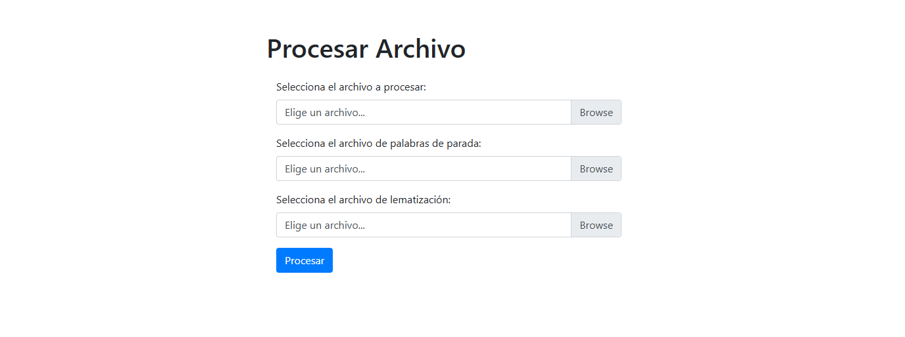

# Gestion del Conocimiento de las Organizaciones: Sistemas de recomendación. Modelos basados en el contenido


**Integrantes del grupo:** 
- Ancor Gonzalez Carballo ([alu0101327679](alu0101327679@ull.edu.es))
- Joel Aday Dorta Hernández ([alu0100987584](alu0100987584@ull.edu.es))
- Jose Pablo Ruiz Galvan ([alu0101328447](alu0101328447@ull.edu.es))
- Jose Javier Ramos Carballo ([alu0101313313](alu0101313313@ull.edu.es))

---

# Índice

1. [Introducción](#1-introducción)
2. [Codigo Desarrollado](#2-codigo-desarrollado)
3. [Ejemplo de Uso](#3-ejemplo-de-uso)
4. [Conclusiones](#4-conclusiones)

---

# 1. Introducción

El objetivo de esta práctica es implementar un sistema de recomendación siguiendo el modelo basados en el contenido.

---

# 2. Codigo Desarrollado

```c++

//meter codigo de las movidas

```

---

# 3. Ejemplo de uso

Para poder utilizar nuestra herramienta, debe acceder al siguente [enlace](https://alu0101328447.github.io/GCO_SR_Contenido/), y en él, le aparecerá la sigiente pagina



Una vez en el, debemos introducir una serie de ficheros que se nos indican en la pagina, los cuales son:

- **Archivo a procesar**, indican los ficheros con los que queremos trabajar, los cuales, se pueden obtener en el siguiente [enlace](https://github.com/ull-cs/gestion-conocimiento/tree/main/recommeder-systems/examples-documents)  

> [!INFO]  
> Concretamente en este apartado se recomienda que se aporten mas de un fichero para que los calculos no salgan con valor 0.

- **Stop-Words**, es un fichero que nos permite filtrar que palabras del texto se pueden saltar del calculo. Este fichero se puede conseguir en el siguiente [enlace](https://github.com/ull-cs/gestion-conocimiento/tree/main/recommeder-systems/stop-words)
- **Corpus**, es un fichero que nos permite lematizar los terminos de nuestro texto, permitiendo que a la hora colocar las _palabras mayores_ no resulte en diferentes palabra que se refieren a lo mismo. Dicho fichero se puede obtener en el siguiente [enlace](https://github.com/ull-cs/gestion-conocimiento/tree/main/recommeder-systems/corpus) 

> [!WARNING]  
> Sobre los archivos que vamos a introducir, se requiere que los tres esten escritos en el mismo idioma, para que la aplicación funcione correctamente.

Al colocar los ficheros pertinentes, simplemente podemos ejecutar el programa y este nos dara un fichero llamado **_salida.json_**
donde podemos leer los diferentes parametros pedidos en la practica, y al final del fichero, podemos encontrar el calculo entre las similitudes entre los 
ficheros que pasamos para procesar.

---

# 4. Conclusiones

Finalmente, con este apartado terminamos de explicar y comentar nuestra implementación de un sistemas de recomendación mediante los metodos de filtrado colaborativo.

**_aqui la movida seria meter mas paja de como funciona, a modo de resumen de lo que hemos hablado en el resto de informe_**

---